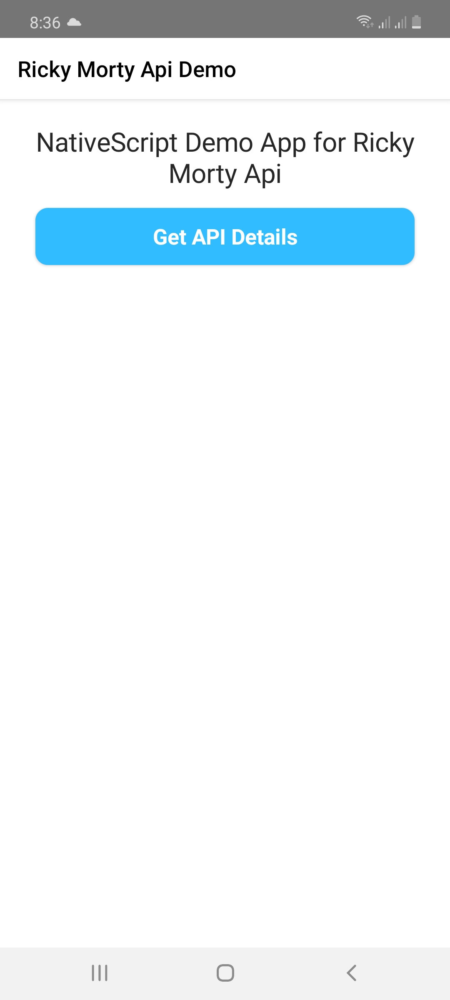
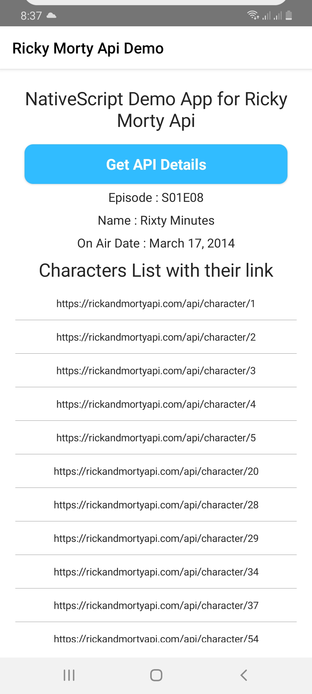
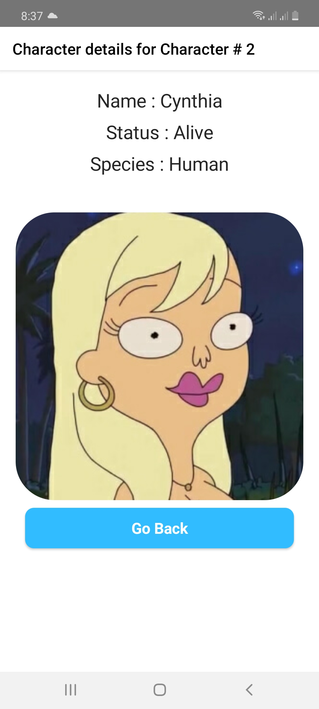

# nativescript-rickandmorty-api
NativeScript App demonstrating working with API calls. For this project I have used Rick and Morty Public Api. The App has two screens, page contents and events. First Page contains list of all characters of Season 8. by pressing any of the character link second page navigation is triggered which then makes another api call for displaying character details such as name, picture etc. You can review codebase by cloning and do let me know in case of any issue.

## Screens
Here is the screens of the app. First Page loads with no data. API data is pulled on press event and populated with details (this example pulls season 8 details). Once populated, user can click on any of the links, which is link to character details API link. on link press, app navigates to second page and populates with character details such as name, gender, image etc. 

This project focuses on working with API calls in nativescript and app design from style and look perspective is not taken much into consideration, with simple and clearn layout. 

  

## installation 

* Get repo clone
* route to the project directory
* for IOS
  * run `tns run ios`
* for Android
  * run `tns run android`
* for NativeSript Playground App (you need to install NativeScript playground for IOS or Android platform)
  * run `tns preview`

if you face issues with discrepencies, make sure to run `npm install` in project directory. This will download all required dependencies. Then you can run with no issues. 

Happy Coding. Cheers ! 
